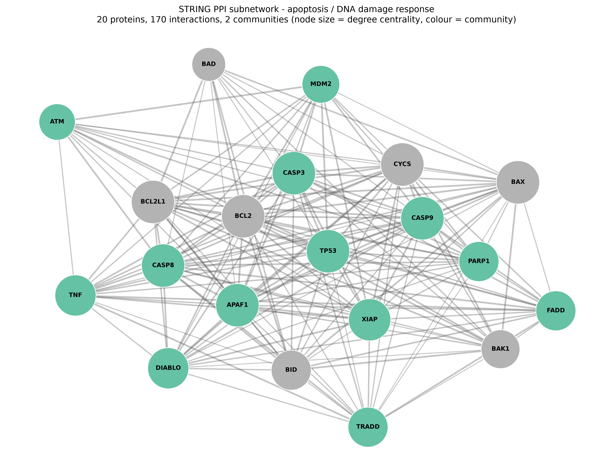

# netbio-pipeline

A small, reproducible network-biology pipeline that runs as containerised HPC jobs. It builds a protein-protein interaction subnetwork from STRING, computes centrality and community structure, and draws the result. Each stage runs inside a container and is submitted to a SLURM scheduler with dependencies between stages, the same shape as a real cluster workflow.

The point was to get hands-on with the container-and-HPC stack used in computational biology: Docker, Apptainer/Singularity, and SLURM.



## What it does

The pipeline analyses an apoptosis / DNA-damage-response gene set (TP53, the caspases, the BCL2 family, and related regulators). It:

- pulls the protein-protein interactions among those genes from the STRING database (human, species 9606)
- builds a weighted graph and computes degree and betweenness centrality
- detects communities with greedy modularity optimisation
- writes a ranked hub-gene table and a network figure

The biology reads off the figure: TP53 and the executioner caspases sit central and high-degree, and the network splits into two interacting communities.

## Pipeline architecture

Three stages, each a separate script with explicit inputs and outputs, so every step can run as its own scheduled job:

| Stage | Script | Reads | Writes |
|-------|--------|-------|--------|
| 1. Fetch | `src/01_fetch_data.py` | STRING API | `data/edges.csv` |
| 2. Metrics | `src/02_metrics.py` | `data/edges.csv` | `outputs/hub_genes.csv` |
| 3. Downstream | `src/03_downstream.py` | edges + hub table | `outputs/network.png` |

One container image runs all three stages. On the scheduler, stage 2 waits for stage 1 and stage 3 waits for stage 2, enforced through SLURM job dependencies.

## Reproducibility

- Direct dependencies are pinned to exact versions in `requirements.txt`. The full transitive set is frozen in `requirements.lock`, which is what the image installs.
- The image is built once with Docker, then converted to an Apptainer `.sif` for HPC use, so the same environment runs on a laptop and on a cluster.
- Given the same inputs, the pipeline regenerates byte-identical outputs.

## Running it

You can run the pipeline at four levels, from plain Python up to a scheduler. All commands run from the project root.

The gene list, species ID and STRING request parameters live in `config.yaml` at the project root; edit that file to point the pipeline at a different question. Stage 1 reads `./config.yaml` by default, or pass `--config path/to/other.yaml` to override it. The container images bake in a copy, so bind-mount your own over it (e.g. `-v ./config.yaml:/app/config.yaml`, or `--bind ./config.yaml:/app/config.yaml` for Apptainer) to change it without rebuilding.

### 1. Plain Python

```bash
python -m venv venv
source venv/bin/activate
pip install -r requirements.txt
python src/01_fetch_data.py
python src/02_metrics.py
python src/03_downstream.py
```

### 2. Docker

```bash
docker build -t netbio:latest .
docker run --rm -v ./data:/app/data netbio:latest src/01_fetch_data.py
docker run --rm -v ./data:/app/data -v ./outputs:/app/outputs netbio:latest src/02_metrics.py
docker run --rm -v ./data:/app/data -v ./outputs:/app/outputs netbio:latest src/03_downstream.py
```

### 3. Apptainer / Singularity

```bash
apptainer build netbio.sif docker-daemon://netbio:latest
apptainer run --bind ./data:/app/data netbio.sif src/01_fetch_data.py
apptainer run --bind ./data:/app/data,./outputs:/app/outputs netbio.sif src/02_metrics.py
apptainer run --bind ./data:/app/data,./outputs:/app/outputs netbio.sif src/03_downstream.py
```

### 4. SLURM

Submit the full dependency chain and watch it run:

```bash
bash slurm/submit_all.sh
squeue
```

Each stage has its own job script under `slurm/` with `#SBATCH` resource requests. `submit_all.sh` chains them so each stage starts only when the previous one succeeds.

## Running with Snakemake

The `Snakefile` at the project root describes the same three-stage DAG, so Snakemake works out the order, re-runs only what is out of date, and handles job submission in place of `submit_all.sh`. It reads the same `config.yaml`, so the gene list and STRING parameters still live in one place; editing that file re-runs the whole chain.

Locally, in the venv from level 1:

```bash
snakemake --cores 1
```

This fetches the apoptosis subnetwork from STRING, computes the hub table, and draws `outputs/network.png`. A second run does nothing until an input changes. Add `-n` for a dry run that just prints the plan.

Inside the Apptainer image from level 3 (each rule runs in `netbio.sif`):

```bash
snakemake --cores 1 --sdm apptainer --apptainer-args "--bind ./data:/app/data,./outputs:/app/outputs"
```

On a SLURM cluster, submitting each rule as its own job:

```bash
snakemake --profile profiles/slurm
```

The profile runs every stage inside `netbio.sif` with the same binds and the same CPU, memory and time requests as the scripts in `slurm/`. Snakemake stays on the login node and submits each stage once the one before it succeeds.

## Repository layout

```
src/                pipeline stages (fetch, metrics, downstream)
slurm/              one SLURM job script per stage + submit_all.sh
Snakefile           the same pipeline as a Snakemake workflow
profiles/slurm/     Snakemake profile: one SLURM job per rule
requirements.txt    direct dependencies, pinned
requirements.lock   full frozen dependency set (used by the image)
Dockerfile          builds the pipeline image
docs/network.png    example output figure
```

## Requirements

Python 3.12. Docker and Apptainer are optional, needed only for the container and HPC levels. For the SLURM level, any SLURM installation works, including a single-node local setup.

## Notes and next steps

I built this to learn the workflow a computational-biology group actually uses, not just the individual tools. The first step past the hand-written submit script was a workflow manager: the `Snakefile` now handles the stage dependencies and job submission automatically. A natural next step is to fan the workflow out over several gene sets or organisms, which Snakemake handles with wildcards.
